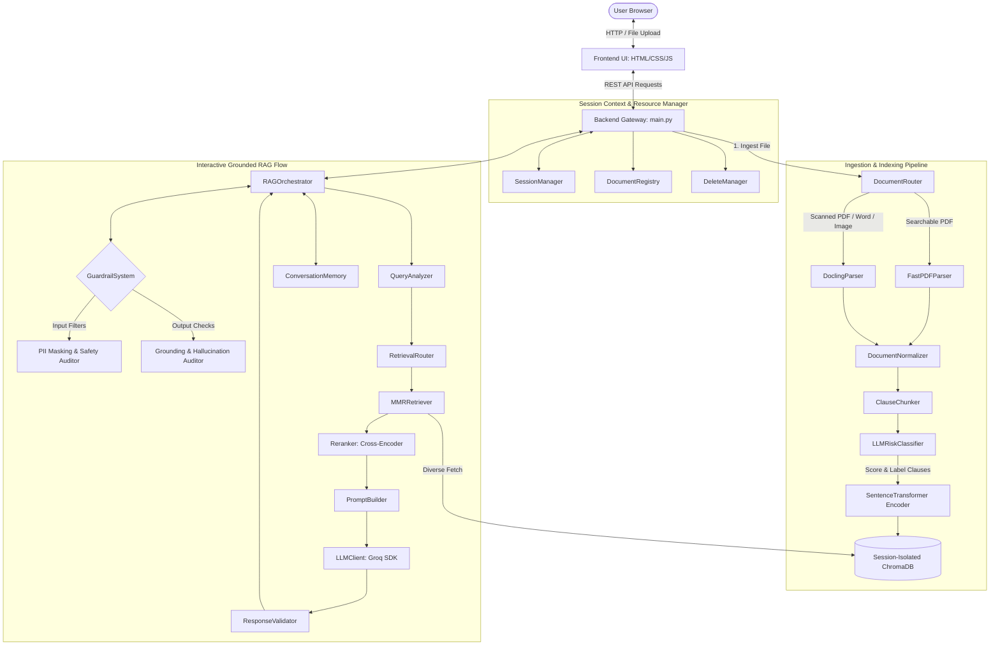
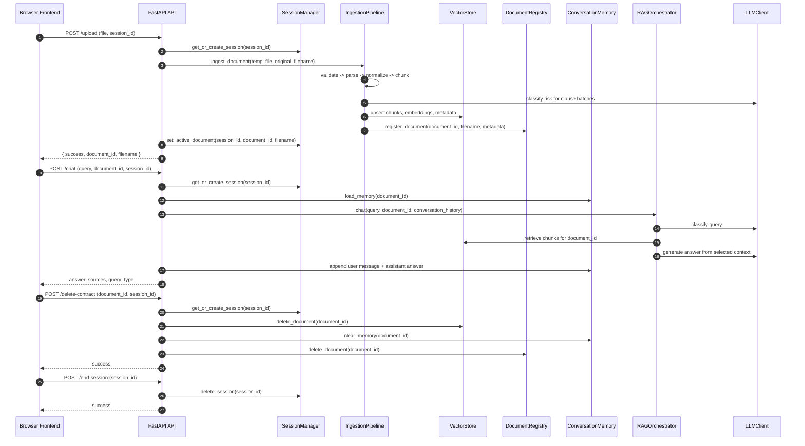
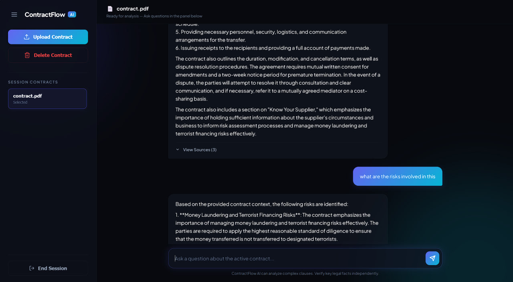

# ContractFlow AI — Intelligent Contract Analyzer with Grounded RAG

An enterprise-grade, privacy-first legal document assistant powered by **Retrieval-Augmented Generation (RAG)**. ContractFlow AI automatically processes, parses, normalizes, indexes, and queries complex contracts. By utilizing multi-stage safety guardrails, Max Marginal Relevance (MMR) retrieval, and cross-encoder re-ranking, it guarantees grounded, hallucination-free, and context-rich answers.

This project uses a session-isolated storage architecture. All user uploads, embeddings, registries, and memory traces are isolated by unique session IDs, making absolute session deletion and cleanups easy and secure.

---

##  Tech Stack

<div align="center">
  <h2>Tech Stack</h2>
  
   &nbsp;
   &nbsp;
   &nbsp;
  
  
  <br><br>
  
   &nbsp;
   &nbsp;
   &nbsp;
   &nbsp;
  
</div>

---

##  Core Capabilities

###  Session-Based Architecture
ContractFlow AI enforces complete data segregation using **Session-Isolated Environments** rather than shared table schemas.
- **Zero Cross-Talk**: Each browser connection is issued a unique UUID (`session_id`). This ID namespaces the underlying directory folders, document registries, vector DB stores, and chat log caches.
- **Dynamic Connection Binding**: The ChromaDB client establishes persistent DB links scoped *only* to the session storage folder, preventing any data leakages across other active sessions.
- **Automated Hard-Deletion**: The moment a session is terminated via `POST /end-session`, the disk controller executes a recursive purge of the session folder, instantly erasing all indexed vectors, history traces, and registries.

###  Dual-Layer Safety Guardrails
The application implements pre-input and post-generation safety checking to preserve security and context relevance.
- **Input Inspection**:
  - **Prompt Injection Filter**: Blocks adversarial inputs aiming to override system instructions or extract configurations.
  - **Off-Topic Refusals**: Ensures queries stay focused strictly on legal terms, agreements, liabilities, or general contract definitions.
- **Output Grounding Validator**: Passes the generated answer alongside retrieved source contract chunks to a fact-verification engine. If claims are made that cannot be traced to the source context, the response is blocked as a hallucination.
- **PII Leakage Prevention**: Input queries and output responses are continuously audited for Personally Identifiable Information. Using optimized regex patterns, any email addresses, phone numbers, Social Security Numbers (SSNs), and Credit Card details are scrubbed and replaced with placeholders like `[REDACTED_EMAIL]`.

###  Advanced RAG Pipeline
Retrieval is optimized for complex legal terminology using a two-stage approach:
- **Max Marginal Relevance (MMR)**: Standard semantic retrievers often load near-duplicate sections due to repetitive contract phrasing. MMR runs PyTorch vector math to maximize chunk diversity alongside semantic closeness.
- **Cross-Encoder Re-ranking**: Retrieved chunks are fed into a cross-encoder model (`ms-marco-MiniLM-L-6-v2`) to perform absolute joint query-context alignment grading, filtering out marginal results.
- **Sliding Conversation Window**: Conversation memory uses a structured sliding context window to feed historical messages into LLM templates without overloading token capacity.

---

##  System Architecture

###  Architecture Flowchart

The following flowchart diagrams how user transactions move through the ingestion layers, query routing controllers, and safety guardrails:



---

###  End-to-End Sequence Flow

This sequence chart diagrams the backend coordination sequence when a document is uploaded, queried, deleted, or when a session is finalized:



---

###  Storage Model & Layout

Every browser connection triggers a dedicated directory tree under `storage/sessions/<session_id>/`. This isolation makes data protection compliance straightforward: removing the session folder deletes the vector data, history, and raw files.

```text
storage/
   sessions/
      <session_id>/
         chroma_db/             # Local database storing vector embeddings
         chat_memory/           # Per-document chat history files
            <document_id>.json
         registry.json          # List of documents uploaded in this session
         session_state.json     # Tracks the active document ID and filename
   llm_daily_usage.json         # Shared rate-limiting usage counter file
```

---

##  Module-by-Module Walkthrough

### 1. Backend Gateway & Session Manager (`/backend`)
- [main.py](file:///d:/project/contract-intelligence/backend/api/main.py): Sets up the FastAPI app instance, CORS configurations, mounts static/template directories, and registers REST routes for document uploads, conversation messaging, session loading/teardowns, and contract deletions.
- [session_manager.py](file:///d:/project/contract-intelligence/backend/session_manager.py): Organizes isolated working directories for each unique user session. It dynamically instantiates separate ChromaDB database paths, document registries, and memory folders, preventing cross-tenant leakage.
- [delete_manager.py](file:///d:/project/contract-intelligence/backend/delete_manager.py): Orchestrates the hard-deletion of documents, including removing corresponding vector IDs from ChromaDB and purging references from registries/cache files.

### 2. Ingestion Pipeline (`/ingestion`)
- [route.py](file:///d:/project/contract-intelligence/ingestion/route.py): An intelligent router evaluating incoming document extensions and properties. Searchable PDFs are routed to a fast text parser, while scanned PDFs, images, and Word files are forwarded to docling-driven OCR parsers.
- [docling_parser.py](file:///d:/project/contract-intelligence/ingestion/docling_parser.py) & [fast_pdf_parser.py](file:///d:/project/contract-intelligence/ingestion/fast_pdf_parser.py): Extraction modules that convert raw document layouts, structural elements, and tables into plain text blocks.
- [normalizer.py](file:///d:/project/contract-intelligence/ingestion/normalizer.py): Formats extracted text blocks by removing redundant whitespace, fixing Unicode representations, and stripping formatting artifacts.
- [chunker.py](file:///d:/project/contract-intelligence/ingestion/chunker.py): Performs layout-aware, semantic clause division. Rather than basic character windowing, it splits texts along structural clause boundaries to keep definitions whole.
- [vector_store.py](file:///d:/project/contract-intelligence/ingestion/vector_store.py): Implements interfaces for ChromaDB. It retrieves sentence embedding representations via classes from the model manager class and updates local session indexes.

### 3. Retrieval & Re-ranking (`/retrieval`)
- [mmr_retriver.py](file:///d:/project/contract-intelligence/retrieval/mmr_retriver.py): Generates vector search queries and performs **Max Marginal Relevance (MMR)** selection using PyTorch tensor math, ensuring that context chunks are both semantically close and structurally diverse.
- [reraanker.py](file:///d:/project/contract-intelligence/retrieval/reraanker.py): Employs a cross-encoder model (`cross-encoder/ms-marco-MiniLM-L-6-v2`) to re-rank chunks based on absolute prompt-context alignment, filtering out marginal matches.

### 4. LLM Interface (`/llm`)
- [llm_client.py](file:///d:/project/contract-intelligence/llm/llm_client.py): Integrates directly with the Groq SDK, deploying the high-throughput `llama-3.1-8b-instant` model. It features exponential backoff retries and structures thread-safe daily request limit counters to avoid API exhaustion.
- [prompt_builder.py](file:///d:/project/contract-intelligence/llm/prompt_builder.py): Dynamically creates prompt templates, embedding context chunks, user query profiles, and conversation memories into highly structured assistant instructions.

### 5. Guardrail System (`/orchestration`)
- [guardrails.py](file:///d:/project/contract-intelligence/orchestration/guardrails.py): The primary security framework containing:
  - **PII Leakage Prevention**: Identifies and redacts regex-mapped emails, phones, SSNs, and credit cards from inputs and outputs.
  - **Input Safety Check**: Uses a fast LLM evaluation to reject off-topic questions (e.g. general coding, hobbies, trivia) and prompt-injection attempts.
  - **Output Grounding Validator**: Fact-checks generated answers against the source contract chunks to flag and block hallucinations.
- [response_validator.py](file:///d:/project/contract-intelligence/orchestration/response_validator.py): Performs heuristic and text-matching quality evaluations on generated outputs to verify formatting constraints.

### 6. Orchestration & Memory (`/orchestration`, `/memory`)
- [rag_orchestrator.py](file:///d:/project/contract-intelligence/orchestration/rag_orchestrator.py): Coordinates the RAG pipeline. It handles incoming queries, verifies input safety, triggers query classification and routing, queries vector indexes, re-ranks contexts, feeds prompts to Groq, verifies output grounding, and structures memory.
- [query_analyzer.py](file:///d:/project/contract-intelligence/orchestration/query_analyzer.py): Classifies queries (e.g., `summary`, `risk`, `obligation`, `qa`) to optimize downstream retrieval models.
- [retrieval_router.py](file:///d:/project/contract-intelligence/orchestration/retrieval_router.py): Adjusts retrieval limits (`initial_fetch_k`, `final_k`) based on the query classification (e.g., fetching broader contexts for summaries, but tighter contexts for clause searches).
- [conversation_memory.py](file:///d:/project/contract-intelligence/memory/conversation_memory.py): Stores message exchanges locally within session files, acting as a sliding conversational history window.

### 7. Risk Analysis Module (`/risk_analysis`)
- [llm_risk_classifier.py](file:///d:/project/contract-intelligence/risk_analysis/llm_risk_classifier.py): Scores batches of clauses during the ingestion phase using LLM reasoning to evaluate potential liabilities, indemnification issues, or non-standard provisions.
- [risk_analyzer.py](file:///d:/project/contract-intelligence/risk_analysis/risk_analyzer.py): Queries the vector database for high-risk clauses and generates structured legal risk assessment reports.

---

##  API Endpoints Reference

| HTTP Method | Route | Content-Type | Request Parameters / Body | Response Summary |
| :--- | :--- | :--- | :--- | :--- |
| **GET** | `/` | `application/json` | None | `{ "message": "Backend Running" }` (Health Check) |
| **POST** | `/upload` | `multipart/form-data` | `file`: UploadFile<br>`session_id`: Form string | `{ "success": true, "document_id": "...", "filename": "..." }` |
| **POST** | `/chat` | `application/json` | `{ "query": "...", "document_id": "...", "session_id": "..." }` | `{ "success": true, "answer": "...", "sources": [...], "query_type": "..." }` |
| **POST** | `/delete-contract`| `application/json` | `{ "document_id": "...", "session_id": "..." }` | `{ "success": true }` (Clears document records) |
| **GET** | `/session-state` | Query Parameters | `session_id`: string | `{ "success": true, "session_id": "...", "document_id": "...", "filename": "...", "documents": [...], "messages": [...] }` |
| **POST** | `/session-active-document` | `application/json` | `{ "document_id": "...", "session_id": "..." }` | `{ "success": true, "document_id": "...", "filename": "..." }` |
| **POST** | `/end-session` | `application/json` | `{ "session_id": "..." }` | `{ "success": true }` (Hard deletes session folder) |
| **GET** | `/frontend/templetes/index.html` | `text/html` | None | Serves the HTML frontend interface page |

---

##  User Interface Showcase

Below are structured layout blocks where you can add screenshots of your running application. To embed your own images, place them inside your assets folder and update the image URLs.

### 1. Document Upload & Ingestion Interface
*A clean, modern, and dark-themed glassmorphic dashboard featuring drag-and-drop file uploaders, session states, and active file lists.*
<table>
  <tr>
    <td align="center">
      
    </td>
  </tr>
</table>

### 2. Context-Aware Grounded Chat
*A persistent, responsive sidebar managing past chat memories and uploaded contracts, retaining state across browser refreshes.*
<table>
  <tr>
    <td align="center">
      
    </td>
  </tr>
</table>

### 3. Memory Based Chat 
*Memory based conversation architecture to remember the old messages and context.*
<table>
  <tr>
    <td align="center">
      
    </td>
  </tr>
</table>

### 4. Terminating a Session
*Terminating the session created so that all the files related to it gets deleted and is not saved anywhere.*
<table>
  <tr>
    <td align="center">
      
    </td>
  </tr>
</table>

---

##  Setup & Installation

### Prerequisites
- Python 3.9+
- A Groq Cloud account and API key.

### 1. Clone & Set Up Directory
```bash
git clone <your-repository-url>
cd contract-intelligence
```

### 2. Configure Virtual Environment
```powershell
# Create environment
python -m venv venv

# Activate on Windows (PowerShell)
.\venv\Scripts\activate

# Activate on Linux/macOS
source venv/bin/activate
```

### 3. Install Dependencies
```bash
pip install -r requirements.txt
```

### 4. Configure Environment Variables (`.env`)
Create a `.env` file in the project root:
```env
GROQ_API_KEY=your_groq_api_key_here
LLM_DAILY_REQUEST_LIMIT=1000
LLM_DAILY_USAGE_PATH=storage/llm_daily_usage.json
```

### 5. Start Backend Server
```bash
uvicorn backend.api.main:app
```

### 6. Start Frontend App
Open the entrypoint file directly in your browser:
- [frontend/templetes/index.html](frontend/templetes/index.html)

Ensure your browser has access to the local port `8000` to hit the REST endpoints.

---

##  Key Design Principles & Roadmap

### Key Design Principles
1. **Isolated Multi-Tenancy**: Zero crossover between session variables, databases, or memory states.
2. **True Grounding**: All LLM queries must base responses strictly on indexed context chunks to avoid hallucinated liability reviews.
3. **Simple Teardown**: Simple folder purges erase all session traces.
4. **Intuitive UX**: Rich visual feedback channels state progress directly to users.

---

##  Author & Creator

This system was created and architected by:
- **Author**: **Aaryan Yadav**
- **GitHub**: [@aaryanyaadav](https://github.com/aaryanyaadav)
- **Project Repository**: [AI-Contract-Analyzer-with-RAG](https://github.com/aaryanyaadav/AI-Contract-Analyzer-with-RAG)

If you find this project helpful for contract automation or RAG-based analysis, please give it a ⭐ on GitHub!
